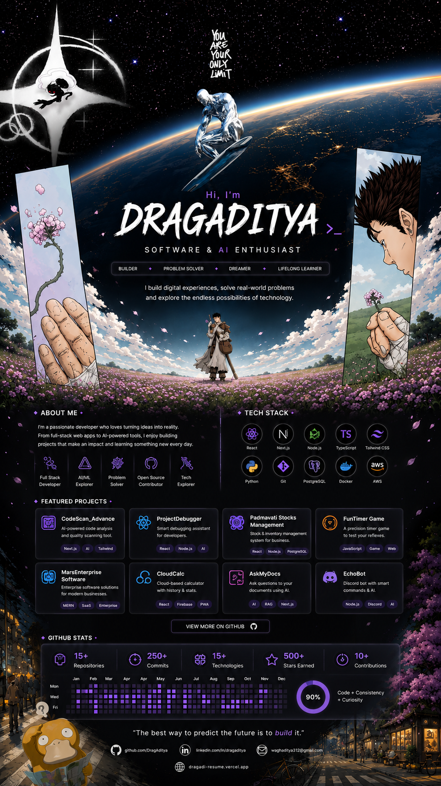

<!-- ████████████████████████████████████████████████████████████ -->
<!--       ADITYA WAGH — GITHUB README · ULTRA INFINITY EDITION  -->
<!-- ████████████████████████████████████████████████████████████ -->
<p align="center">
  
</p>


<div align="center">

<!-- CINEMATIC HEADER BANNER -->


<!-- TYPING SVG — REAL FACTS ABOUT ADITYA -->
<a href="https://github.com/DragAditya">
  
</a>

<br/>

<!-- HERO LINKS -->
<p>
  <a href="https://dragadi-resume.vercel.app" target="_blank">
    
  </a>
  <a href="https://www.npmjs.com/package/dragadix" target="_blank">
    
  </a>
  <a href="https://projectdebugger.onrender.com" target="_blank">
    
  </a>
</p>

<!-- SOCIALS -->
<p>
  <a href="https://linkedin.com/in/DragAdi"></a>
  <a href="https://github.com/DragAditya"></a>
  <a href="mailto:waghaditya312@gmail.com"></a>
  <a href="https://x.com/MeneKudhKiya"></a>
  <a href="https://instagram.com/mr.aditya.in"></a>
  <a href="https://facebook.com/AdityaWagh"></a>
</p>

<!-- PROFILE METRICS -->
<p>
  
  
  
  
</p>

</div>

<!-- QUICK NAV -->
<p align="center">
  <a href="#-whoami"></a>
  <a href="#-ls-projects---all---detailed"></a>
  <a href="#-cat-tech_stackyaml"></a>
  <a href="#-neofetch---github"></a>
  <a href="#-git-log---journey"></a>
  <a href="#-curl--s-apiconnectaditya"></a>
</p>


---

## `> whoami`

```typescript
// ─────────────────────────────────────────────────────────────────
//  dragaditya.ts  ·  MCA '26 · BCA 8.93 CGPA · Builder · Dreamer
// ─────────────────────────────────────────────────────────────────

const ADITYA_WAGH = {

  identity: {
    name       : "Aditya Wagh",
    alias      : "DragAditya",
    age        : 21,
    timezone   : "IST (UTC+5:30) — but also alive at 3am",
    base       : "Amalner ↔ Shirpur, Maharashtra 🇮🇳",
    education  : "MCA @ IMRD Shirpur | BCA 8.93 CGPA, KBC North Maharashtra Univ.",
    contact    : "waghaditya312@gmail.com · +91 8329177017",
    links      : {
      portfolio : "https://dragadi-resume.vercel.app",
      github    : "https://github.com/DragAditya",
      npm       : "https://npmjs.com/package/dragadix",
      live_app  : "https://projectdebugger.onrender.com",
    },
  },

  currently_building: [
    "🔬 CodeScan         — AI debugger, Gemini + Grok dual-API, FastAPI + React + Supabase",
    "💍 Padmavati Girvi  — Gold loan system for family jewelry biz, Firebase PWA",
    "📚 MCA Coursework   — DBMS · ML · IoT · SPM @ IMRD Shirpur",
    "🐍 GitHub Automation — auto-label, auto-assign, tracking dashboard on Pages",
  ],

  certifications: [
    "☁️  AWS Certified Solutions Architect",
    "🔐 Cybersecurity Analyst — TATA Forage",
    "🤖 GenAI Developer       — BCG X",
  ],

  beliefs: [
    "Ship fast, fix later — but actually fix it.",
    "Documentation is a love letter to your future self.",
    "One Piece has better leadership lessons than any MBA.",
    "Black holes are just nature's 404 errors.",
    "Tea before 8 AM is non-negotiable.",
    "Dark humor is just pattern matching on suffering.",
  ],

  open_to: ["BigTech", "Startups", "Freelance", "Research"],
  status  : "🟢 Online · Available for Opportunities",
};
```


---

## `> ls ./projects --all --detailed`

<div align="center">

```
 ╭──────────────────────────────────────────────────────────────────────────╮
 │                   🚀  PRODUCTION · LIVE · IN THE WILD                    │
 ╰──────────────────────────────────────────────────────────────────────────╯
```

</div>

| &nbsp; | Project | Description | Stack | Status |
|:------:|:--------|:-----------|:------|:------:|
| 🔬 | **[CodeScan](https://github.com/DragAditya)** | AI-powered code analysis and debugging platform that scans code for bugs, security issues, and optimization opportunities using modern AI. | `Python` `FastAPI` `Gemini API` `React` `Supabase` | `🟢 Active` |
| ⚡ | **[CodeScan_Advance](https://github.com/DragAditya)** | Advanced version of CodeScan with enhanced AI analysis, deeper security scanning, performance insights, and intelligent debugging workflows. | `Python` `FastAPI` `Gemini API` `React` `Tailwind CSS` | `🟢 Active` |
| 📦 | **[DragX-CLI](https://npmjs.com/package/dragadix)** | Natural-language CLI for Git and GitHub. Execute complex Git operations using simple English or Hinglish commands. Published on npm. | `Node.js` `CLI` `npm` `GitHub API` | `🟢 Published` |
| 🤖 | **[GithubAutomation](https://github.com/DragAditya)** | Automates GitHub workflows including repository management, commits, releases, and developer productivity tasks. | `Python` `GitHub API` `Automation` | `🟢 Active` |
| 🎮 | **[FunTimer-Game](https://github.com/DragAditya)** | Ultra-responsive browser timer game with swipe controls, fullscreen support, smooth animations, and mobile-first gameplay. | `HTML` `CSS` `JavaScript` | `🟢 Live` |
| 🎬 | **[MarsTapes](https://marstapes.onrender.com)** | Modern media and content management platform for organizing and exploring digital collections with a sleek interface. | `React` `JavaScript` `Tailwind CSS` | `🟡 Stable` |
| 🛡️ | **[ProjectDebugger](https://projectdebugger.onrender.com)** | AI-powered debugging assistant that explains programming errors in simple language and provides intelligent code fixes. | `Python` `Gemini API` `FastAPI` | `🟢 Active` |

<div align="center">

```
 ╭──────────────────────────────────────────────────────────────────────────╮
 │              🏛️  ACADEMIC SYSTEMS · Pratap College (2022–2025)            │
 ╰──────────────────────────────────────────────────────────────────────────╯
```

| System | Tech | Impact |
|:-------|:-----|:-------|
| 📚 Library Management System | Java · MySQL | Replaced manual book-tracking for entire college |
| 📋 Attendance Management System | Python · MySQL · Reports | Digital attendance replacing pen-and-paper |

</div>


---

## `> cat tech_stack.yaml`

<div align="center">

<table>
<tr>
<td align="center" width="50%">

**⚡ Languages**
<br/>


</td>
<td align="center" width="50%">

**🌐 Frontend**
<br/>


</td>
</tr>
<tr>
<td align="center">

**🧠 Backend**
<br/>


</td>
<td align="center">

**☁️ Cloud & Infra**
<br/>


</td>
</tr>
<tr>
<td align="center">

**🗄️ Databases**
<br/>


</td>
<td align="center">

**🛠️ Tools & DevOps**
<br/>


</td>
</tr>
</table>

<br/>

**🤖 AI / API Layer**


**📊 Data & ML**


</div>

<br/>

<div align="center">

```
  SKILL DEPTH MATRIX  ── measured in production incidents survived ──
  ──────────────────────────────────────────────────────────────────
  Python          ████████████████████████░   Expert
  Java            ██████████████████░░░░░░░   Advanced
  JavaScript/TS   ████████████████████░░░░░   Advanced
  FastAPI         ████████████████░░░░░░░░░   Proficient
  React + Vite    ███████████████░░░░░░░░░░   Proficient
  AWS             █████████████░░░░░░░░░░░░   Certified
  Firebase/Supabase ████████████░░░░░░░░░░░   Proficient
  Three.js / WebGL █████████░░░░░░░░░░░░░░░   Intermediate
  Docker          ███████░░░░░░░░░░░░░░░░░░   Learning
  ──────────────────────────────────────────────────────────────────
```

</div>


---

## `> neofetch --github`

<!-- TROPHIES -->
<div align="center">
  
</div>

<br/>

<!-- STATS GRID -->
<div align="center">
<table>
  <tr>
    <td width="50%" align="center">
      
    </td>
    <td width="50%" align="center">
      
    </td>
  </tr>
  <tr>
    <td align="center">
      
    </td>
    <td align="center">
      
    </td>
  </tr>
</table>
</div>

<br/>

<!-- WAKATIME STATS -->
<div align="center">
  
</div>

<br/>

<!-- ACTIVITY GRAPH -->
<div align="center">
  
</div>


---

## `> git log --journey`

```
 ORIGIN STORY ──────────────────────────────────────────────────────────────

 2022 ──▶ Started BCA @ KBC North Maharashtra University, Jalgaon
          └─ First line of code. Everything broke. Loved it.

 2022-25 ─▶ Academic Software Developer @ Pratap College
          ├─ Library Management System      (Java + MySQL)
          └─ Attendance Management System   (Python + MySQL)

 2024 ──▶ BCA Completed · 8.93 CGPA 🎓
          └─ Shipped ALTER (first AI app) + DRAGX (first npm package)

 2025 ──▶ MCA @ IMRD Shirpur · Roll 170 · PRN 2025015400894477
          ├─ Certifications: AWS · Cybersecurity (TATA) · GenAI (BCG X)
          ├─ Shipped: VoidScan · CodeScan · UniStro · Portfolio V7
          ├─ Built: Padmavati Jewellers website + Padmavati Girvi system
          └─ Building: BurnerNotes · GitHub Automation Dashboard

 2026+ ──▶ BigTech? Startup? Research? All three simultaneously?
          └─ "Just vibing." — Aditya Wagh, tea in hand, 5:47 AM

 ───────────────────────────────────────────────────────────────────────────
```


---

## `> ps aux | grep active_builds`

<div align="center">

```
 ┌─────────────────────────────────────────────────────────────────────────┐
 │  🔬  CodeScan  v1.0  ·  AI Debugging Platform                           │
 │  Dual inference: Gemini API + Grok API running in parallel              │
 │  ████████████████████████████████████████████░░░░░░  88% complete       │
 │  Stack: FastAPI · React/Vite · Supabase · Python · TypeScript           │
 └─────────────────────────────────────────────────────────────────────────┘

 ┌─────────────────────────────────────────────────────────────────────────┐
 │  💍  Padmavati Girvi  v0.9  ·  Gold Loan Management                     │
 │  Private mobile-first PWA for family jewelry business in Amalner        │
 │  ████████████████████████████████████████░░░░░░░░░░  75% complete       │
 │  Stack: Vanilla JS · Firebase · Google Auth Whitelist · Chart.js        │
 └─────────────────────────────────────────────────────────────────────────┘

 ┌─────────────────────────────────────────────────────────────────────────┐
 │  🔥  BurnerNotes  v0.4  ·  Self-Destructing Messaging                   │
 │  Privacy-first. No accounts. Messages vanish after read.                │
 │  ████████████████████████████░░░░░░░░░░░░░░░░░░░░░░  55% complete       │
 │  Stack: React · Supabase Edge Functions · E2E Encryption                │
 └─────────────────────────────────────────────────────────────────────────┘
```

</div>


---

## `> grep -r "interests" /brain --recursive`

<div align="center">

<table>
<tr>
<td align="center" width="33%">

**🏴‍☠️ Anime Tier List**
```
One Piece        ★★★★★  S+
Steins;Gate      ★★★★★  S+
Attack on Titan  ★★★★★  S+
Death Note       ★★★★★  S+
Code Geass       ★★★★★  S+
Naruto           ★★★★☆  S
```

</td>
<td align="center" width="33%">

**🕳️ Hyperfixations**
```
Black Holes      ████████████  ∞
Time Theories    ███████████░  99%
AI / ML          ██████████░░  90%
Astronomy        █████████░░░  85%
Cybersecurity    ████████░░░░  78%
Stargazing       ███████░░░░░  70%
```

</td>
<td align="center" width="33%">

**☕ Daily OS**
```
05:30  Boot up
05:45  Tea() initialized
06:00  Peak focus mode
08:00  Still productive
12:00  College.exe
18:00  Side projects
00:00  "one more commit"
03:00  git push && sleep()
```

</td>
</tr>
</table>

</div>

---

## `> cat /etc/philosophy.conf`

<div align="center">

```
╔══════════════════════════════════════════════════════════════════════════╗
║                                                                          ║
║   ▄▀█ █▀▄ █ ▀█▀ █▄█ ▄▀█    █░█░█ ▄▀█ █▀▀ █░█                          ║
║   █▀█ █▄▀ █ ░█░ ░█░ █▀█    ▀▄▀▄▀ █▀█ █▄█ █▀█                          ║
║                                                                          ║
║  "Gear 5 hua toh hua — code bhi break hoga, fix bhi ho jaega."          ║
║                                                                          ║
║  ╔────────────────────────────────────────────────────────────────────╗  ║
║  │  Motto      : Ship fast. Read the stacktrace. Ship again.         │  ║
║  │  Morning    : 5:30 AM + ☕ Tea = dangerous productivity level     │  ║
║  │  Ambition   : BigTech → Startup → Research → all three            │  ║
║  │  Side quest : Always building something cursed at 3am             │  ║
║  │  Personality: Introvert who ships extrovert-level projects        │  ║
║  │  Reality    : MCA kid from Shirpur changing the game slowly       │  ║
║  │  Dark truth : "just vibing" is a coping mechanism and a strategy  │  ║
║  ╚────────────────────────────────────────────────────────────────────╝  ║
║                                                                          ║
╚══════════════════════════════════════════════════════════════════════════╝
```

</div>

---

## `> curl -s api.connect/aditya`

<div align="center">
<h3>🤝 Open for Collabs, Opportunities & Good Conversations</h3>

<p>
  <a href="https://dragadi-resume.vercel.app">
    
  </a>
  &nbsp;
  <a href="mailto:waghaditya312@gmail.com">
    
  </a>
  &nbsp;
  <a href="https://linkedin.com/in/DragAdi">
    
  </a>
</p>

<br/>

> 💬 *"Open to BigTech · Startups · Freelance · Research — slide into my DMs, seriously."*

<br/>

<!-- FOOTER WAVE -->


<sub>
  <code>dragaditya.ts</code> — compiled before 8 AM, somewhere in Maharashtra ·
  <a href="https://dragadi-resume.vercel.app">dragadi-resume.vercel.app</a>
</sub>

</div>

<!--
  ╔════════════════════════════════════════════╗
  ║   Aditya Wagh · DragAditya · MCA '26      ║
  ║   waghaditya312@gmail.com                 ║
  ║   Built with ☕ tea, dark humor & Gemini  ║
  ╚════════════════════════════════════════════╝
-->
